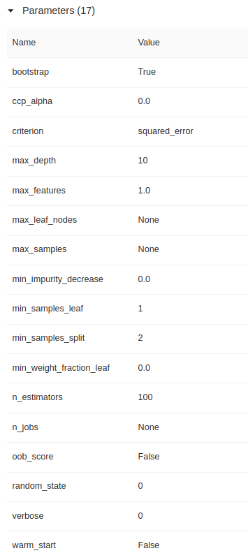
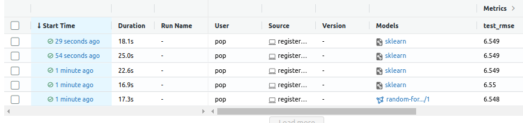

# MLZ Module 2

Code placed inside the `code` folder


# Q1

```
mlflow --version 
```

Ans: 1.26.0

# Q2


```
python preprocess_data.py --raw_data_path ./data --dest_path ./output
```

Ans: 4

# Q3



```
python train_sol.py --data_path ./output
```
Answer: 17


# Q4

```
mlflow server --backend-store-uri sqlite:///mlflow.db --default-artifact-root ./mlruns
```
Answer: default-artifact-root


# Q5


```
python hpo_sol.py
```

best loss: 6.6284257482044735

Ans: 6.628


# Q6

(I have named the experiment 'random-forest-hyperopt1')



```
best_run = client.search_runs(
        experiment_ids=experiment.experiment_id,
        run_view_type=ViewType.ACTIVE_ONLY,
        max_results=log_top,
        order_by=["metrics.test_rmse ASC"]
    )[0]
    
mlflow.register_model(f"runs:/{best_run.info.run_id}/model", "random-forest-best-models")
```

lowest loss: 6.549
Ans: 6.55
